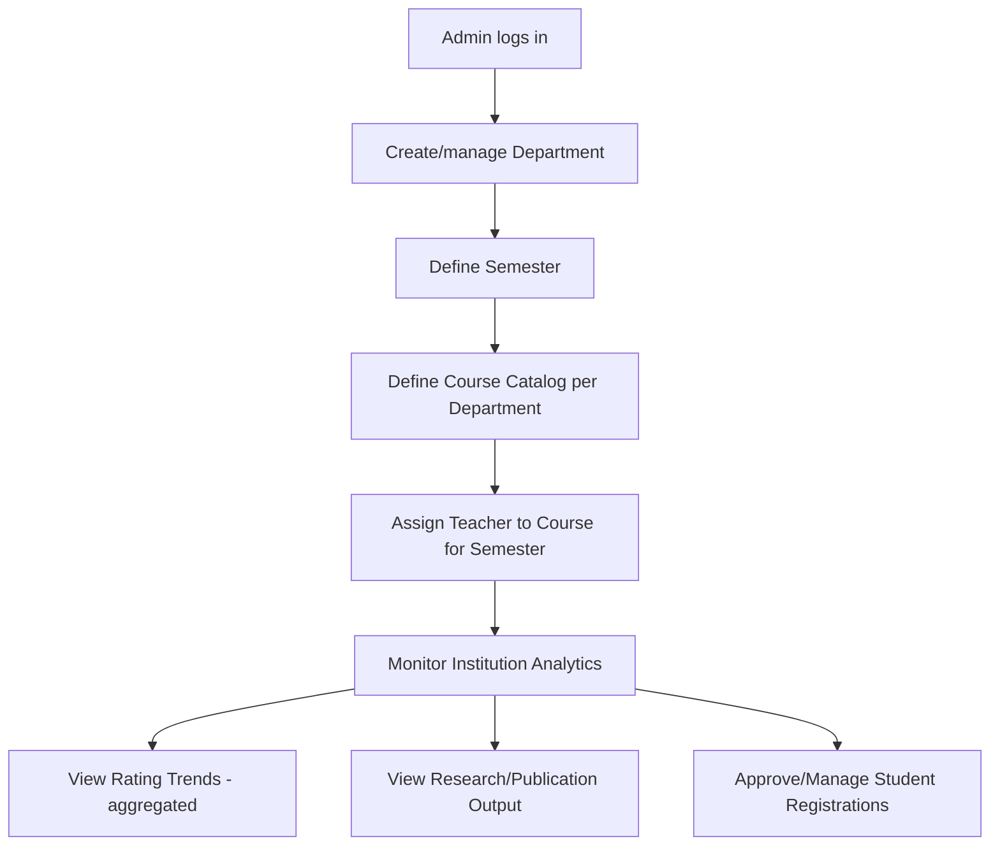
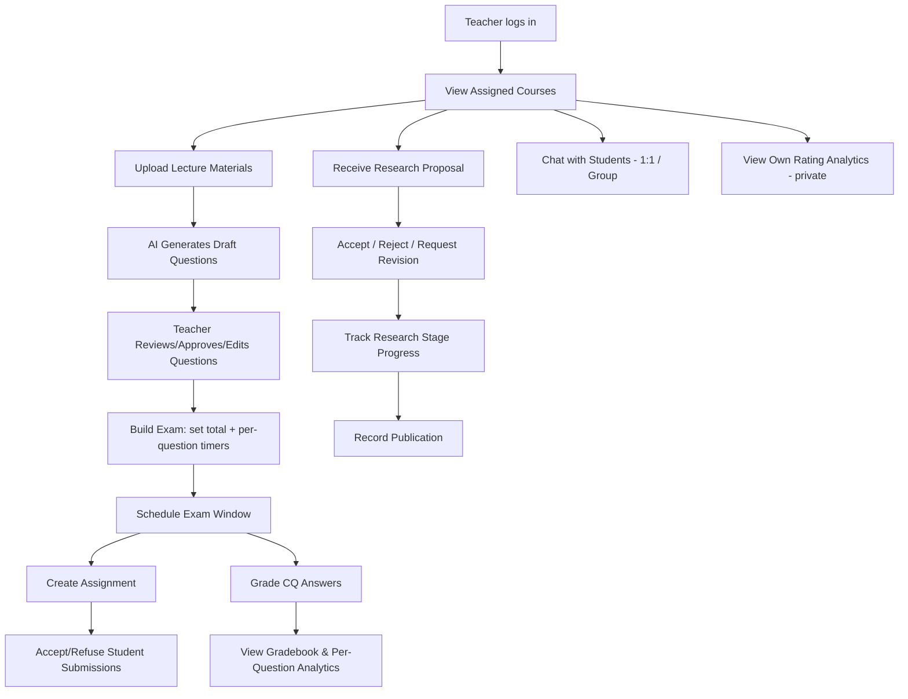
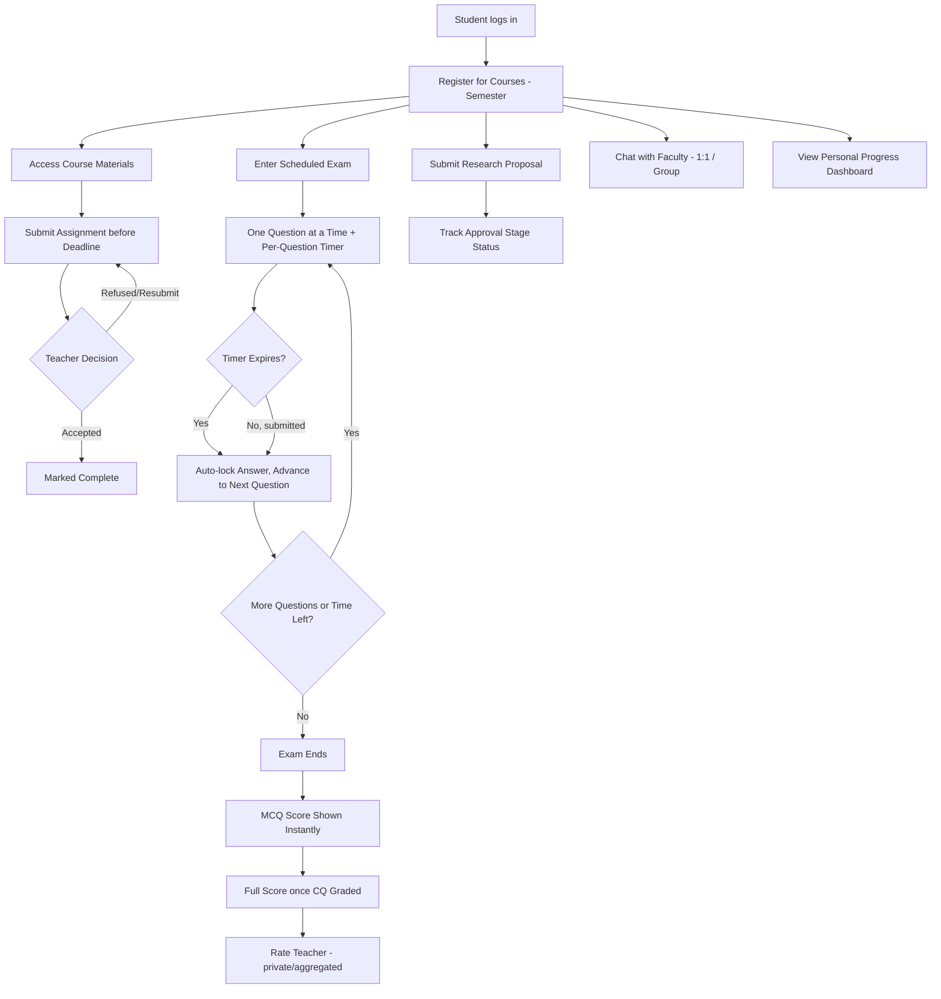
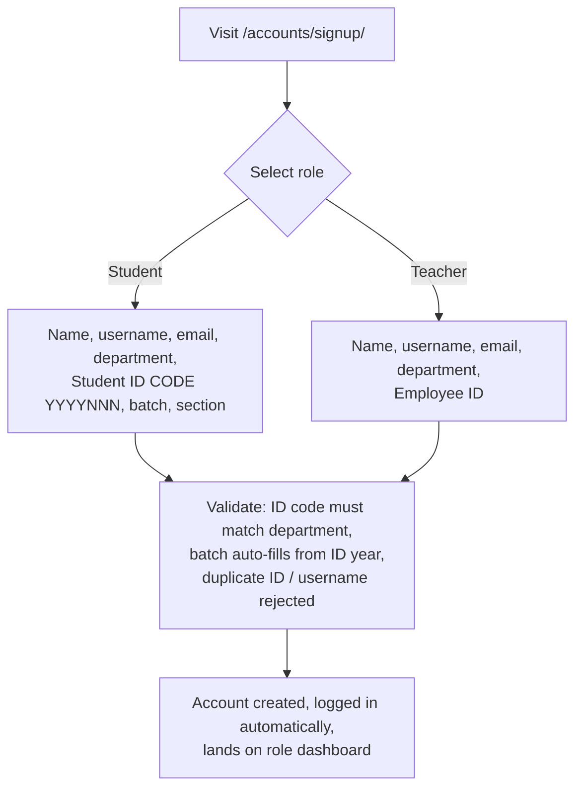

# Product Requirements Document (PRD)

## Project Name: Scholaris

---

## 1. Overview

NITER (National Institute of Textile Engineering and Research) currently uses an Educational Management System (EMS) that is used almost exclusively for **attendance tracking**. It does not support course materials, assignments, exams, research/thesis supervision, publication tracking, faculty-student communication, or performance analytics. As a result, these processes happen manually or over informal channels (email, Facebook groups, paper), which is inefficient, unstructured, and unscalable.

**Scholaris** is a unified academic and research management platform built for NITER's actual academic structure: 5 departments (Textile Engineering, Industrial Production & Engineering, Fashion Design & Apparel Engineering, CSE, EEE), a closed-credit bi-semester system of **8 semester slots (Semester 1–8, two per year)**, and 9–10+ courses per semester.

Department short codes (used in student IDs and throughout the UI): **CS** = CSE, **EE** = EEE, **TE** = Textile Engineering, **FD** = Fashion Design & Apparel Engineering, **IP** = Industrial & Production Engineering.

---

## 2. Problem Statement

| Pain Point | Current State | Impact |
|---|---|---|
| Course/material distribution | Ad-hoc (email, messaging apps) | Materials get lost, no version control, unequal access |
| Assignments & exams | Manual/paper or informal online forms | No structure, slow grading, no analytics |
| Research & thesis supervision | Email + in-person, no tracking | Proposals lost, no audit trail of feedback/approval stages |
| Publication records | Not centrally tracked | No institutional visibility into research output |
| Faculty-student communication | Informal, unofficial | No record, no boundaries, hard to moderate |
| Faculty feedback | Little to none | No structured, private mechanism for course/teaching improvement |
| Notices & routines | Scattered across notice boards, groups | Missed deadlines, confusion |
| EMS | Attendance only | Everything else happens outside the system of record |

---

## 3. Goals

1. Give every role (Admin, Teacher, Student) one system for the academic lifecycle instead of five disconnected tools.
2. Make assessment (assignments + exams) digital, auditable, and partly automated (AI-assisted question generation, auto-grading for MCQ).
3. Make research/thesis supervision a trackable, staged workflow instead of an email thread.
4. Give faculty structured, private feedback instead of none.
5. Be realistically deployable at NITER — role-based, department-aware, credit/semester-aware.

## 4. Non-Goals (Out of Scope for v1)

- Payment/tuition processing.
- Hostel, transport, or medical-center modules (separate problem-statement tracks).
- Mobile native apps (web-responsive only for v1).
- Public-facing rating leaderboards (ratings are private/aggregated — see §7.7).

---

## 5. User Personas

### 5.1 Admin (Department/Institution level)
Manages departments, semesters, course catalog, teacher-to-course assignment, and views institution-wide analytics (ratings trends, research output, at-risk students).

### 5.2 Teacher
Manages assigned courses: uploads materials, sets assignments and exams, grades CQ answers, supervises research/thesis, publishes research, communicates with students, views own rating analytics.

### 5.3 Student
Enrolls in courses, accesses materials, submits assignments, takes exams, submits research proposals, communicates with faculty, views personal progress/results, rates faculty.

---

## 6. Feature Analysis by Module

### 6.1 Academic Program Management
- **8-semester system**: every department runs Semesters 1–8, two per year (1–2 = Year 1, 3–4 = Year 2, 5–6 = Year 3, 7–8 = Year 4). Semesters are numbered, with the year derived from the number.
- Admin defines departments, semesters, and the **course catalog per department per semester** — the Syllabus module (`/admin/syllabus/`).
- **Admin People management**: admin can add / view / edit every teacher and student account, and the student list is grouped by **admission year → department → section**.
- **Self sign-up (role-first)**: both students and teachers register themselves at `/accounts/signup/` — they pick a role first (Teacher/Student), then fill role-specific fields (see §7.4). Student IDs follow the NITER format `CODE YYYYNNN` and the code must match the selected department; the admission batch auto-fills from the ID year.
- Admin assigns a **teacher to a course for a specific semester** (many-to-many: a teacher can teach multiple courses; a course can have multiple sections/teachers).
- Students register for courses within their department's credit rules for that semester (prerequisite-aware in future phases; v1 allows manual/admin-approved registration).
- **Unified notice board & routine**: replaces scattered notices — one place for class schedule changes, deadlines, and announcements, scoped by department/course/institution-wide.

### 6.2 Course Materials
- Teachers upload lecture notes, slides, and research materials per course.
- Versioned storage (re-uploads don't destroy history).
- Access strictly scoped to enrolled students of that course/section.

### 6.3 Assignments & Online Exams

**Assignments**
- Teacher creates an assignment with a description, due date, and file/text submission requirement.
- Students submit before the deadline; teacher can **accept or refuse/request-resubmission** with a comment.

**Online Exams — Core Differentiator**
- Teacher builds a **question bank** per course (MCQ and CQ/written types).
- **AI-assisted question generation**: teacher uploads material, AI drafts candidate MCQ/CQ questions, teacher reviews and approves/edits/discards each one before it enters the bank. AI never publishes a question directly to students.
- Teacher assembles an exam from approved bank questions:
  - Sets a **total exam duration**.
  - Sets an **individual per-question time limit**.
  - Schedules the exam window (start time, eligible students = enrolled students).
- **Exam-taking experience**:
  - One question shown at a time, full-screen.
  - Each question has its own visible countdown.
  - When a question's timer expires, the current answer (or blank) auto-locks and the **next question auto-advances**. No backtracking.
  - The exam also has an overall timer running in parallel; the exam ends when either the overall timer or the last question is reached.
  - **Timer enforcement is server-side** (not just client JS) to prevent manipulation — see `technology.md` / `backend.md`.
- **Grading**:
  - MCQ: auto-graded on submission against the stored correct answer.
  - CQ: queued to the teacher's grading dashboard; teacher grades at their convenience (marks + optional comment per answer).
- **Results**:
  - Student sees MCQ score immediately; full score once CQ portions are graded.
  - Teacher sees a full gradebook: per-student and per-question breakdown (e.g., "60% of the class missed Q4") — useful for identifying weak topics.

### 6.4 Research & Thesis Supervision
- Student submits a research/thesis proposal to a teacher.
- Teacher can **accept, reject, or request revision**, with comments, at each stage.
- Staged workflow: Proposal → Progress Checkpoints → Draft → Final Submission → Publication link.
- Every stage is timestamped and commented — creates an audit trail that email threads don't.

### 6.5 Publications
- Teachers (and supervised students) record publications tied to their profile and, where applicable, to a research/thesis record.
- Institution-level visibility into research output by department/teacher (feeds Admin Analytics).

### 6.6 Communication
- **Official chat system**: 1:1 (student ↔ teacher) and group chat, auto-scoped to course enrollment (a course automatically has a group channel for its enrolled students + teacher).
- Kept inside the platform so there's a record, unlike informal channels.

### 6.7 Attendance
- Retained (NITER's EMS already does this), but repositioned as **one input signal** among several (assignment scores, exam scores, quiz results) rather than the entire product — feeds the student progress view.

### 6.8 Faculty Ratings
- Students rate teachers, typically post-semester or post-module.
- **Private by design**: ratings are aggregated and shown to Admin (and the teacher themselves, in aggregate) — never a public leaderboard, and never shown until a minimum response threshold is met, to prevent individual identification or targeting.
- Purpose is institutional course-quality improvement, not public shaming.

### 6.9 AI Layer

| Feature | Description | Phase |
|---|---|---|
| AI Question Generation | Generates draft MCQ/CQ questions from uploaded course material; teacher must review/approve | v1 (MVP) |
| Student Progress & Gap Analysis | Combines attendance + assignment + exam performance to flag weak topics per student | Phase 2 (needs real usage history to be meaningful) |

### 6.10 Admin Analytics
- Department-level dashboards: course load per teacher, rating trends (aggregated/anonymized), research output, at-risk student flags (once Phase 2 AI is live).

---

## 7. Role Workflows

### 7.1 Admin Workflow

### 7.2 Teacher Workflow

### 7.3 Student Workflow

### 7.4 Self Sign-up (Role-First)

Both **students and teachers self-register**; admins are created by an existing admin or via `createsuperuser`. The sign-up flow asks for the role first, then shows role-specific fields:

- **Student ID format**: department code + year + serial, e.g. `TE 2405038` (TE = Textile, CS = CSE, EE = EEE, FD = Fashion Design & Apparel, IP = Industrial & Production). The code prefix must match the selected department.
- **Batch (admission year)** is optional — if left blank it derives automatically from the ID year (e.g. `CS 2605777` → batch 2026).
- **No published demo credentials** — seeded users get random passwords printed once at seed time (or a shared `SEED_PASSWORD` env var for deterministic setups).

---

## 8. MVP Scope (Hackathon Demo)

The MVP is the **exam system end-to-end**, wrapped by the minimum surrounding modules needed to make it a real, live-clickable story rather than an isolated feature. See `development-plan.md` for the full breakdown and demo script.

In scope for the demo: Admin People & Syllabus management → Admin course assignment → Student enrollment → Teacher material upload → AI question generation & approval → Exam build & schedule → Student exam-taking with per-question timers → MCQ auto-grade + CQ manual grade → Results → Faculty rating (private aggregation).

Also built and live (post-SQA hardening): a **public landing page** (what Scholaris is, how it works, per-role login guide, animated AI-exam-flow demo), **role-first self sign-up** for students and teachers, **admin People management** (CRUD for all accounts, students grouped by year → department → section), **admin Syllabus management** (courses per department per semester, add/update/delete with delete-blocked-when-assigned), and the **Semester 1–8** term structure.

Out of scope for the live demo (shown as roadmap/wireframes only): full research/thesis workflow, publication tracking, group chat, notice board, Phase 2 gap-analysis AI.

## 9. Success Metrics (Post-Hackathon / Real Deployment)

- % of courses actively using materials/assignments/exams module vs. attendance-only baseline.
- Average time-to-grade for CQ answers (should drop vs. manual/paper grading).
- Faculty rating response rate per course (engagement signal).
- Number of AI-generated questions approved vs. discarded (AI quality signal).

## 10. Risks & Mitigations

| Risk | Mitigation |
|---|---|
| Client-side timer manipulation in exams | Server-side timestamp validation on every question submission (see `backend.md`) |
| Faculty resistance to ratings | Private, aggregated, minimum-response-threshold design (§6.8) |
| AI-generated questions being low quality or wrong | Human-in-the-loop: AI drafts, teacher must approve before use |
| Scope creep beyond hackathon timeline | Hard MVP boundary — see `development-plan.md` |
| Neon free-tier compute auto-suspends when idle, causing a cold-start delay on the first query after inactivity | Use the pooled connection string; warm the database with a request a few minutes before any live demo (see `development-plan.md` Phase 6) |
