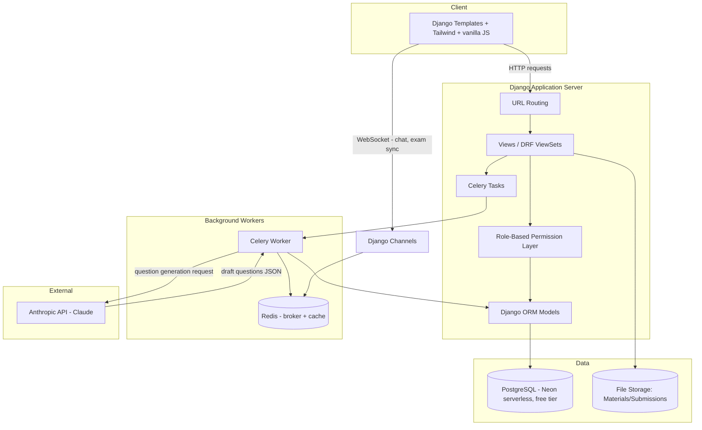
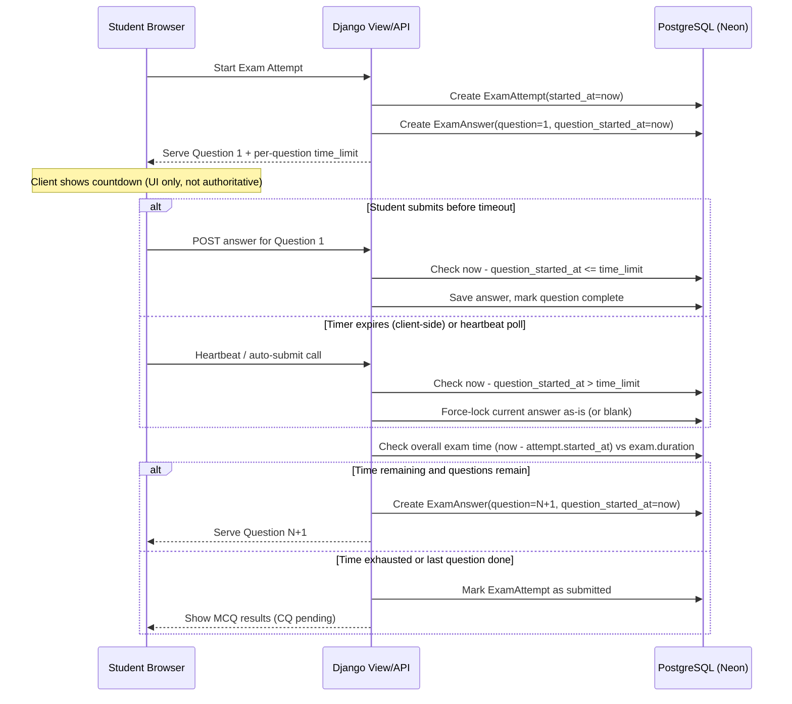
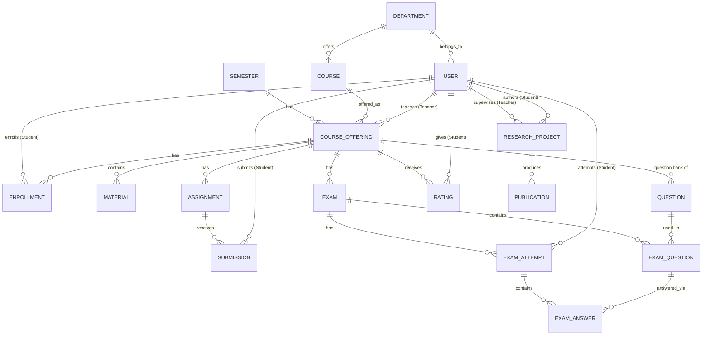

# Technology Documentation

## 1. Stack Summary

| Layer | Technology | Reason |
|---|---|---|
| Backend framework | Django (function-based views + JSON API for the exam engine) | Batteries-included, fast to build auth/RBAC/admin for a hackathon timeline, mature ORM fits a relational academic data model |
| Database | PostgreSQL via **Neon** (serverless Postgres, free tier) | Relational integrity for departments/courses/enrollments/exams; supports JSONB for flexible AI-question metadata; free tier means zero local DB setup for every team member, and the same connection string works in dev and in the deployed demo |
| Frontend | Django Templates + Tailwind CSS + vanilla JS | Server-rendered pages are fastest to ship for a hackathon; a small dedicated JS module handles the exam countdown (`exam_timer.js`), and light vanilla JS handles the role-first sign-up toggle and syllabus inline edit |
| Real-time | — (not built; planned) | Chat is roadmap-only; the exam flow needs no WebSockets because timer enforcement is server-side on every request/heartbeat |
| Background tasks | — (no Celery/Redis) | AI calls run synchronously behind a thin service layer (`ai_integration/services.py`) — the exact code a Celery task would call. Exam sweep happens server-side on every answer/heartbeat/render instead of a beat task |
| AI | Anthropic API (Claude), server-side only; **offline fallback generator** when no API key is set | Question generation from uploaded material; never exposed client-side. The offline generator is deterministic/extractive so the human-in-the-loop flow demos without network |
| File storage | Django `FileField` → ephemeral serverless disk + extracted text cached in DB (`Material.content_text`) | Lecture materials; text lives in the DB so AI generation works even on ephemeral Vercel disk. S3-compatible storage is the production upgrade path |
| Auth | Django's built-in auth + role field, session-based | Fast to implement, sufficient for hackathon scope |
| Deploy | **Vercel** (auto-detected Django) + shared Neon DB | Pushes to `main` auto-deploy to https://scholaris-lime.vercel.app |

---

## 2. Backend Architecture

**Key architectural decisions:**
- **Role-based permission layer** sits between views and models — every query is scoped by the requesting user's role (Admin/Teacher/Student) and their department/course/enrollment relationships. No cross-department or cross-enrollment data leakage.
- **AI calls happen server-side only** — implemented without Celery: a thin synchronous service layer (`ai_integration/services.py`) holds the exact code a Celery task would run, with an offline fallback generator when no API key is set. The API key never reaches the client.
- **Exam timer enforcement is server-authoritative** (detailed in §3) — the client UI reflects state, but does not decide it. There is no background sweep task: enforcement runs on every answer submission, 5-second heartbeat, and page render.

---

## 3. Exam Timer Enforcement — Workflow Diagram

This is the most technically distinctive part of the system, so it gets its own diagram.

**Why this matters:** relying on client-side JavaScript alone for the countdown is not enforceable — a student can pause execution or tamper with local state. The server independently timestamps question start and validates elapsed time against the stored `time_limit` on every submission or heartbeat poll, so the true enforcement never depends on the client.

---

## 4. Hosted Database — Neon (Serverless Postgres, Free Tier)

The project uses [Neon](https://neon.tech) instead of a locally-installed Postgres instance:

- **One shared connection string** for the whole team and for the deployed demo — no one needs Postgres installed locally, which removes a whole class of "works on my machine" setup friction during the hackathon.
- **Free tier constraints to design around:**
  - **Scale-to-zero / cold start**: an idle Neon compute suspends after a period of inactivity; the first query after idle time incurs a short cold-start delay (roughly 1–2 seconds). This is a real risk for a *live* demo — see the mitigation in `development-plan.md`.
  - **Limited concurrent connections** on the free tier: Django's default persistent connections plus Celery workers can exhaust this quickly. Use Neon's **pooled connection string** (PgBouncer-backed, transaction-mode pooling) for the Django app and Celery workers, not the direct (unpooled) connection string.
  - **Branching** (a Neon feature): a database branch can be created per teammate or per feature if useful, but for hackathon speed the simplest setup is a single shared branch (`main`) for everyone.
- **Connection config**: `DATABASE_URL` is the Neon-provided pooled connection string, and requires `sslmode=require`. Handled via `dj-database-url` in `settings.py` — see `backend.md` §1.

## 5. Database Schema (PostgreSQL)

### 5.1 Entity-Relationship Overview

### 5.2 Table Definitions

**`accounts_user`** (extends Django `AbstractUser`)
| Column | Type | Notes |
|---|---|---|
| id | PK | |
| role | varchar (`admin`, `teacher`, `student`) | set at sign-up via the role-first form; admin via `createsuperuser`/seeded admin |
| department_id | FK → department | nullable for institution-level admin |
| student_id_no / employee_id | varchar | NITER ID; `student_id_no` validated as `CODE YYYYNNN` matching the department's code |
| batch | positive small int, nullable (students) | admission year — auto-derives from the student ID year when blank |
| section | varchar, nullable (students) | e.g. A/B/C |
| created_at | timestamp | |

**`department`**
| id | PK |
| name | varchar (Textile Engineering, IPE, FDAE, CSE, EEE) |

**`semester`** (the 8-slot bi-semester system)
| id | PK |
| number | int (1–8) | Semesters 1–2 = Year 1, 3–4 = Year 2, 5–6 = Year 3, 7–8 = Year 4 |
| name | varchar | rendered as "Semester N" |
| year | derived | computed from `number` (1–2 → Year 1, etc.) |

**`course`** (one row per department × semester — the Syllabus)
| id | PK |
| department_id | FK |
| semester_id | FK → semester | added so each department has a per-semester course list; unique per (department, semester, code) |
| code`, `title`, `credit_hours` | |

**`course_offering`** *(a course taught in a specific semester by a specific teacher — this is the "admin assigns teacher" object)*
| id | PK |
| course_id | FK → course (`PROTECT` — deleting a syllabus course that has offerings is refused) |
| semester_id | FK |
| teacher_id | FK → user |
| section | varchar, nullable |

**`enrollment`**
| id | PK |
| student_id | FK → user |
| course_offering_id | FK |
| registered_at | timestamp |

**`material`**
| id | PK |
| course_offering_id | FK |
| uploaded_by_id | FK → user |
| file`, `title`, `version`, `uploaded_at` | |

**`question`** *(question bank)*
| id | PK |
| course_offering_id | FK |
| type | (`mcq`, `cq`) |
| text | text |
| options | JSONB (MCQ only) |
| correct_answer | JSONB/text (MCQ only) |
| source | (`ai_generated`, `manual`) |
| approved_by_id | FK → user, nullable until teacher approves |
| created_at | timestamp |

**`exam`**
| id | PK |
| course_offering_id | FK |
| title | |
| total_duration_seconds | int |
| start_time`, `end_time` | timestamp |

**`exam_question`** *(ordered join table: exam ↔ question)*
| id | PK |
| exam_id | FK |
| question_id | FK |
| order | int |
| time_limit_seconds | int (per-question limit) |
| marks | int |

**`exam_attempt`**
| id | PK |
| exam_id | FK |
| student_id | FK → user |
| started_at`, `submitted_at` | timestamp |
| status | (`in_progress`, `submitted`, `graded`) |

**`exam_answer`**
| id | PK |
| attempt_id | FK → exam_attempt |
| exam_question_id | FK |
| question_started_at | timestamp *(server-set, for timer enforcement)* |
| answer_data | JSONB |
| auto_score | int, nullable (MCQ) |
| manual_score | int, nullable (CQ) |
| graded_by_id | FK → user, nullable |
| locked | boolean (true once timer expired or submitted) |

**`assignment`**
| id | PK |
| course_offering_id | FK |
| title`, `description`, `due_date` | |

**`submission`**
| id | PK |
| assignment_id | FK |
| student_id | FK → user |
| file/text | |
| status | (`submitted`, `accepted`, `refused`) |
| teacher_comment | text |
| submitted_at` | |

**`research_project`**
| id | PK |
| student_id | FK → user |
| supervisor_id | FK → user |
| title`, `stage` (`proposal`,`checkpoint`,`draft`,`final`,`published`) |
| status | (`pending`,`accepted`,`rejected`,`revision_requested`) |

**`research_stage_log`**
| id | PK |
| research_project_id | FK |
| stage`, `comment`, `changed_by_id`, `timestamp` |

**`publication`**
| id | PK |
| research_project_id | FK, nullable |
| title`, `venue`, `year`, `authors` (JSONB) |

**`rating`**
| id | PK |
| course_offering_id | FK |
| student_id | FK → user *(kept for integrity checks, not exposed in aggregate views)* |
| stars | int (1–5) |
| comment | text, nullable |
| created_at | timestamp |

**`notice`**
| id | PK |
| scope | (`institution`,`department`,`course_offering`) |
| scope_id | int, nullable |
| title`, `body`, `posted_by_id`, `created_at` |

**`chat_group`** / **`chat_message`**
| chat_group: id, course_offering_id (nullable for 1:1), type (`course_group`,`direct`) |
| chat_message: id, group_id, sender_id, body, sent_at |

---

## 6. Security & Data Scoping Notes

- All queries filtered through the permission layer by `request.user.role` + department/enrollment relationship — a student can never query another student's exam attempt or another course's materials.
- AI service layer receives **only the specific uploaded material** for a single generation request — not a student's broader academic record — to keep the data-privacy story simple and defensible.
- Ratings table stores `student_id` for anti-abuse/integrity purposes (e.g., one rating per student per course) but this is never surfaced in any teacher- or admin-facing view; only aggregates are exposed, and only once a minimum response count is met.

## 7. Quality, Security & Testing (SQA pass)

A full SQA pass (scored **97/100**) was run against the live app and every finding fixed. The results are reproducible from the repo:

| Category | Tool / method | Result |
|---|---|---|
| Static analysis (SAST) | semgrep `p/security-audit` (103 rules) + bandit | 0 findings on production code (test-fixture passwords excluded) |
| Dependency & secret scan | pip-audit, npm audit, gitleaks | all clean; no secrets in git history |
| Dynamic scan (DAST) | `dast_probe.py` against the live site | 25/25 probes pass: security headers, XSS/SQLi reflection, auth bypass, method enforcement, session-cookie flags, CSRF |
| Auth & authorization | 100+ test suite | IDOR, RBAC for all 3 roles, session-fixation, mass-assignment, demo-login abuse, CSRF — real bugs found & fixed (see below) |
| Automated tests | Django test suite (100 tests) | runs in CI (GitHub Actions) on every push |
| Load & stress | `loadtest/locustfile.py` (Locust) | 1,118 reqs @ 50 concurrent users, 0 failures |
| Performance | Lighthouse (live) | Performance 93 · Accessibility 100 · Best-practices 100 · SEO 100 |
| Input validation & fuzz | fuzz/edge-case tests in the suite | non-dict JSON → clean 400; oversized titles capped; marks validated |

**Notable bugs found by the SQA and fixed:** non-dict JSON body crashed the answer API (500 → 400); `create_superuser` never set the role so admins couldn't reach `/admin/`; teachers could grade another teacher's answers (now offering-scoped); 5000-char exam titles would crash Postgres (capped at 200); duplicate-offering POST poisoned the surrounding transaction (savepoint pattern).

**CI workflow** (`.github/workflows/ci.yml`) runs on every push: Django tests + bandit + semgrep + pip-audit + npm audit + gitleaks. Live status: green.

**No published demo credentials.** Seeded users get strong random passwords printed once at seed time (`SEED_PASSWORD` env override for deterministic setups). The one-click demo login (`?demo=`) was removed entirely.
